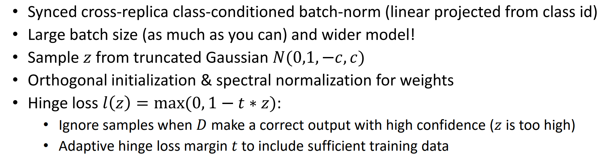
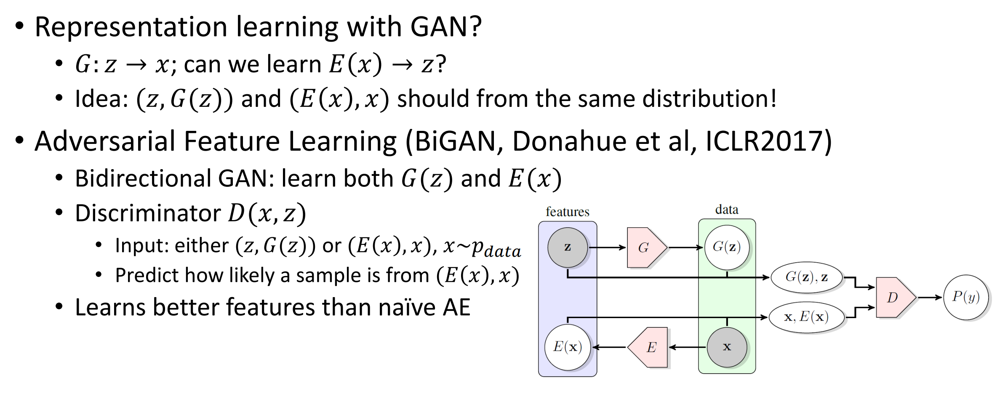
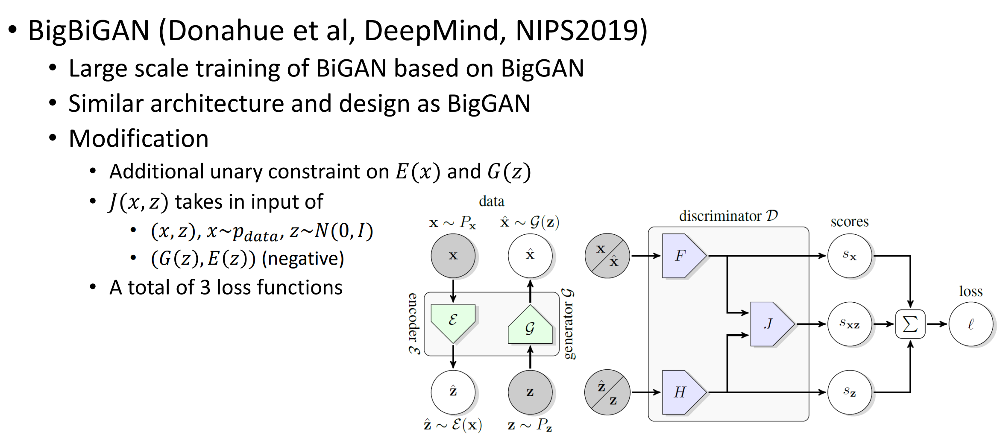
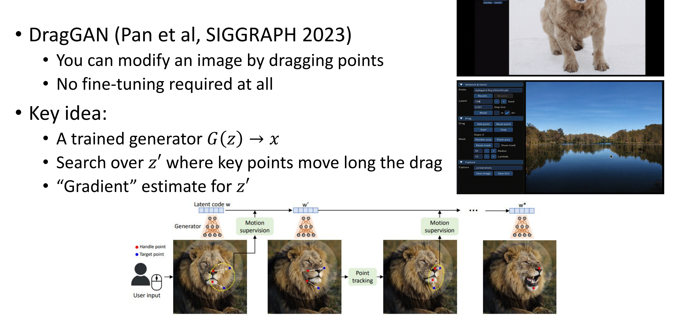

# GAN

## Basic GAN

一个生成器(generator) 和一个分辨器(discriminator)

generator: 生成图像, discriminator: 分辨图像是不是数据集里面的

$$
\begin{cases} D_\phi(x)=1,x\sim p_{data}\\
D_\phi(x)=0, x\text{ not from data}
\end{cases}
$$

$$
L(\theta)=D_\phi(g_\theta(z))
$$

两个神经网络的训练过程:

$$
\theta^*= \max_\phi(D_\phi(g_\theta(z)))=\min_\phi(1-D_\phi(g_\theta(z)))\\
\phi^*=\max_\phi \mathbb{E}_{x\sim g_{data}}[\log D_\phi(x)]+\mathbb{E}_{\hat{x}\sim g}[\log(1-D_\phi(\hat{x}))]
$$

### Training Procedure

$$
L(\theta,\phi)=\min_\theta\max_\phi \mathbb{E}_{x\sim g_{data}}[\log D_\phi(x)]+\mathbb{E}_{\hat{x}\sim g}[\log(1-D_\phi(\hat{x}))]
$$

我们来找对于$x$来说最佳的$D_{\phi^*}(x)$

$$
L(D)=p_{data}(x)\log D+p_G(x)\log(1-D)\\
D^*=\frac{p_{data}(x)}{p_{data}(x)+p_G(x)}\\
$$

$$
L(D)=p_{data}(x)\log \frac{p_{data}(x)}{p_{data(x)+p_G(x)}}+p_G(x)\log(\frac{p_G(x)}{p_{data}(x)+p_G(x)})\\
=KL(p_{data}(x)\|\frac{p_{data}(x)+p_G(x)} 2)+KL(p_G(x)\|\frac{p_{data}(x)+p_G(x)} 2)-\log 4\\
=2JSD(p_{data}(x)\|p_G(x))-\log4
$$

### Evaluation

Inception Score

$$
IS=\exp(\mathbb{E}_{x\sim G}KL(f(y|x)||p_f(y)))
$$

FID score,计算$\mu_p,\Sigma_p,\mu_G,\Sigma_G$根据$p_{data}$, $G(z)$以及inception V3计算

$$
FID=\|\mu_p-\mu_G\|^2+trace(\Sigma_p+\Sigma_G-2\sqrt{\Sigma_p\Sigma_G})
$$

### Questions

**Mode Collapse**

GAN训练的结果倾向于记住几张图片,或者在几个模态之间来回循环. 比如有n个模态,generator倾向于生成$i$的时候discriminator的善于辨别$i-1$,那么会关于$i$循环模态生成,而不会拥有普适的生成能力

**Ability Difference**

Discriminator的能力会更强:在高维空间中分辨原先概率分布和generator的概率分布.

Generator:学习一个低维空间的概率分布以生成一个类似的高维的分布,难度更高.所以discriminator能力应该比generator更强!

## Tricks

### DCGAN

* 使用fully CNN
* 没有池化层/MLP layer
* 不能直接使用supervised CNN
* BN, 分别给$p_{data}$, $G$加
* leaky ReLU for discriminator
* Small lr and momentum

Improved Training Techniques for GAN

* $$
  L(\theta)=\|\mathbb{E}_{\hat{x}\sim G}[f_\phi(\hat x)]-\mathbb{E}_{x\sim p_{data}}[f_\phi(x)]\|^2
  $$
* 切割成若干个minibatch,如果有mode collapse出现,那么每个minibatch中的mode不应该是完全一样的,从而避免mode collapse
* historical averaging weight
* 把正确项的cross entropy前面加一个0.9的系数,希望discriminator不要那么有自信(超过0.9)

### WGAN

$$
W(p,q)=\inf_{\gamma\sim\Pi_{P,Q}}E_{x,y\sim\gamma}\|x-y\|
$$

"把p上的概率分布移到q上所需的做小距离"

**Kantorovich Rubinstein Duality**

$$
W_{p,q}=\frac{1}{K}\sup_{\|f\|_L\le K}\mathbb{E}_{x\sim p}[f(x)]-\mathbb{E}_{x\sim q}[f(x)]
$$

使用KR对偶, 我们有:

$$
L(\phi)=\mathbb{E}_{x\sim p_{data}}[f_\phi(x)]-\mathbb{E}_{x\sim p_G}[f_\phi(x)]\\
L(\theta)=\mathbb{E}_{x\sim G_\theta(z)}[f_\phi(x)]
$$

**Gradient Penalty:**

为了让$f$尽量使1-lipchitz的,我们有$f^*$几乎处处有$\nabla f=1$

WGAN-GP

$$
L(\phi)=\mathbb{E}_{x\sim p_{data}}[f_\phi(x)]-\mathbb{E}_{\tilde{s}\sim p_G}[f(\tilde{x})]+\lambda\mathbb{E}_{\tilde{x}}[(|\nabla_{\tilde{x}}f_\phi(\tilde{x})|^2-1)^2]
$$

### BigGAN

### R3GAN

$$
L(\theta,\phi)=\mathbb{E}_{z\sim p_G,x\sim p_D}\|f(D_\phi(G_\theta(z))-D_\phi(x))\|
$$

$$
R_1(\phi)=\frac{\gamma}{2}\mathbb{E}_{x\sim p_D}\|\nabla_x D_\phi\|^2,R_2(\theta,\phi)=\frac{\gamma}{2}\mathbb{E}_{x\sim p_\theta}[\|\nabla_x D_\phi\|^2]
$$

把梯度乘法(GP)的中心设为0, 以保证convergence

### Semi-supervised GAN

$$
G(z,y)\to x\\
D(x)\to softmax\{l_1,\cdots,l_k,l_{k+1}\}
$$

多一类"fake data", 让D去分辨. 手动让$l_{k+1}=1$

$$
L_\phi(x)=1-p_D(y=k+1|x)\\
L_{sup,\phi}(x)=p_D(y=k|x\& y\le k)=softmax(k|l_1,\cdots,l_k)\\
L_{uns,\phi}(x)=1-p_D(y=K+1|x)=1-softmax(k+1|l_1,\cdots,l_k,1)
$$

### BiGANs

改变初始$z$的sample distribution可以实现"风格转换"(从Gaussian变成其他的)

### CycleGAN

$$
x\to G(x)\to F(G(x))\to x
$$

有两个G和两个D,只有一些没有paired的照片的集合

$$
L_{cyc}=\mathbb{E}_x[\|F(G(x))-x\|_1]+\mathbb{E}_y[\|G(F(y))-y\|_1]
$$

### DragGAN
